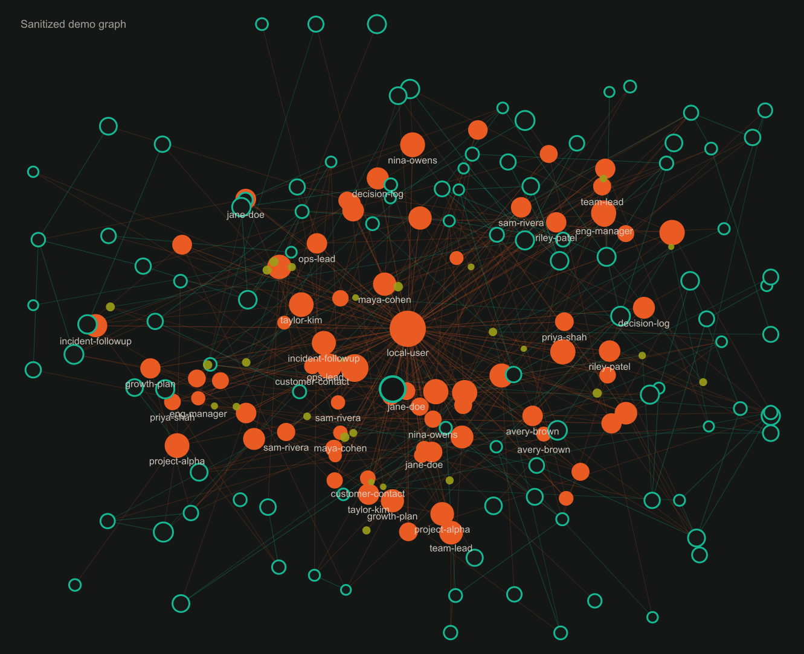

<p align="center">
  
  <br>
  <em>Sanitized demo graph view.</em>
</p>

# Personal Memory

Personal Memory is a local-first RAG memory store for people, projects,
decisions, meetings, incidents, hiring context, and long-running work history.
It gives agents such as Codex and Claude Code a grounded way to remember and
recall context without sending your private memory corpus to a hosted service.

Markdown is the source of truth. The search index is rebuildable. Embeddings run
locally by default.

## Quick Start

Requires Node.js 20 or newer.

```bash
git clone https://github.com/vladimanaev/personal-memory.git
cd personal-memory
npm install
npm run index
npm start
```

`npm start` opens the local UI at `http://127.0.0.1:4664`.

## Use It

Open Claude Code or Codex with this repository as the working directory, then
ask naturally. The agent reads the repo instructions, uses the memory skills,
and calls the local CLI behind the scenes.

```bash
cd personal-memory
claude
```

Or open this folder as the workspace in Codex.

Capture:

```text
"Log this 1:1 with Jane: promotion readiness, scope gaps, and a follow-up for next Friday."
"Remember that the platform team decided to defer project alpha until Q4."
"Capture this incident summary and tag it with reliability."
```

Recall:

```text
"What do I know about Jane's promotion readiness?"
"Find the decision we made about project alpha."
"Help me prep for my next 1:1 with Jane using memory."
```

Plan with memory:

```text
"Use memory to summarize open hiring threads from this quarter."
"What context should I remember before the roadmap review?"
"Pull the relevant history before we decide whether to revisit project alpha."
```

Pull from connected sources:

```text
"Pull recent memories from Gmail and Slack."
"Use the connector settings to ingest memory-worthy updates from the last week."
"Every 4 hours, pull Gmail and Slack and log anything memory-worthy."
```

Connector pulls use the skill system and connector prompts to fetch, filter,
deduplicate, and update memories over time.

Agents should retrieve through the local memory CLI, write through `memory add`,
and cite the memory files they used. The full agent contract is in
[AGENTS.md](AGENTS.md).

## Why This Exists

Long-running work creates context that does not fit in chat history: people,
decisions, feedback, planning threads, hiring notes, operational incidents, and
follow-ups. Personal Memory keeps that context in a local, queryable record that
an agent can retrieve before answering.

Key properties:

- **Local-first**: entries, index, and default embeddings stay on disk.
- **Plain Markdown**: every memory is readable and portable.
- **Hybrid retrieval**: semantic search, BM25 lexical search, and rank fusion.
- **Structured filters**: query by person, team, tag, date, and memory type.
- **Deduped capture**: source IDs and near-duplicate checks avoid noisy repeats.
- **Agent-native**: skills and guardrails tell agents when to capture or recall.
- **Local UI**: browse, search, inspect the graph, and edit connector config.

## CLI Reference

Most users should interact with Personal Memory through an agent. The CLI is the
local engine that agents call, and it is useful when debugging, scripting, or
checking connector/index health.

```text
memory add --title "..." --type <type> [--people a,b] [--teams x,y]
           [--tags a,b] [--date YYYY-MM-DD] [--body "..."]
           [--source-ids slack:C123:1700000000.1,gmail:<thread-id>]
           [--connector raw-capture]
           [--update <id>] [--force-new]

memory query "<question>" ["<alternate phrasing>" ...]
             [--person slug] [--type type] [--team slug] [--tag slug]
             [--since YYYY-MM-DD] [--until YYYY-MM-DD] [-k n] [--deep]

memory list [--person slug] [--type type] [--team slug] [--tag slug]
            [--since YYYY-MM-DD] [--until YYYY-MM-DD] [--limit n]

memory person <slug>
memory digest --person <slug> | --quarter <YYYY-Qn> | --tag <slug>
memory remove <id>
memory maintenance [--threshold n]
memory connectors
memory connectors mark-pulled <name> [--at ISO_TIMESTAMP]
memory connectors mark-captured <name> [--at ISO_TIMESTAMP]
memory ui [--port n] [--no-open]
```

For debugging, run those commands as `npm run memory -- <command>`.

Supported memory types:

```text
event, decision, todo, pending-decision, 1on1, hiring, incident,
achievement, feedback, meeting, note, summary
```

## How It Works

Personal Memory separates durable content from derived search state:

- `memory/entries/YYYY/MM/<id>.md` stores raw memory entries.
- `memory/summaries/<id>.md` stores additive summaries created by `digest`.
- `.index/` stores rebuildable local search artifacts.
- `connectors/<name>.md` stores public connector templates.
- `memory/connectors/<name>.md` stores private connector overrides.

Each entry has strict YAML frontmatter:

```yaml
id: 2026-06-28-acme-kickoff
date: 2026-06-28
type: meeting
title: Kickoff with Acme
people: [jane-doe, john-smith]
teams: [platform-team]
tags: [roadmap, partnership]
source_ids: [slack:C0123ABCD:1700000000.0012]
```

The index combines:

- local embeddings via Transformers.js
- LanceDB for vector search
- persistent BM25 lexical search
- reciprocal rank fusion
- metadata prefilters and source-of-truth validation

Rebuild the index at any time:

```bash
rm -rf .index
npm run index -- --force
```

## Privacy

The default setup is intentionally local:

- `memory/` is ignored by the main git repository.
- `.index/` is ignored and can be regenerated.
- The UI binds to `127.0.0.1`.
- Embeddings run locally with `Xenova/bge-small-en-v1.5`.
- No API backend is used unless you explicitly set `MEMORY_EMBEDDINGS`.

Optional remote embedding backends can be enabled deliberately:

```bash
MEMORY_EMBEDDINGS=openai npm run index -- --force
MEMORY_EMBEDDINGS=voyage npm run index -- --force
```

Do not publish a populated `memory/` directory or screenshots containing private
names, events, or relationships unless you have intentionally sanitized them.

## Agent Workflows

This repository is designed for coding agents that operate over the local
folder. The important conventions live in:

- [AGENTS.md](AGENTS.md) - shared rules for capture, recall, citations, and
  local-only use
- [MEMORY-GUARDRAILS.md](MEMORY-GUARDRAILS.md) - write safety contract for
  `memory/`
- [skills/log-memory/SKILL.md](skills/log-memory/SKILL.md) - creating or
  updating memories
- [skills/recall-memory/SKILL.md](skills/recall-memory/SKILL.md) - retrieving
  grounded context
- [.claude/commands/remember.md](.claude/commands/remember.md) and
  [.claude/commands/recall.md](.claude/commands/recall.md) - Claude Code slash
  commands

Agents should retrieve through the CLI instead of searching `memory/` directly,
and should write entries through `memory add` instead of hand-editing files.

## Development

```bash
npm install
npm run memory -- help
npm run typecheck
npm run index
```

Project layout:

```text
src/                      TypeScript CLI, indexing, schema, server, and UI APIs
src/ui/                   Local browser UI
skills/                   Agent skills for capture, recall, and pull workflows
connectors/               Public connector templates
memory/                   Private memories and connector overrides (gitignored)
.index/                   Rebuildable local index (gitignored)
.claude/                  Claude Code commands, hooks, and settings
docs/assets/              Public README assets
```

## Community

- Contributing: [CONTRIBUTING.md](CONTRIBUTING.md)
- Security reports: [SECURITY.md](SECURITY.md)
- Code of conduct: [CODE_OF_CONDUCT.md](CODE_OF_CONDUCT.md)
- License: [Apache License 2.0](LICENSE)
