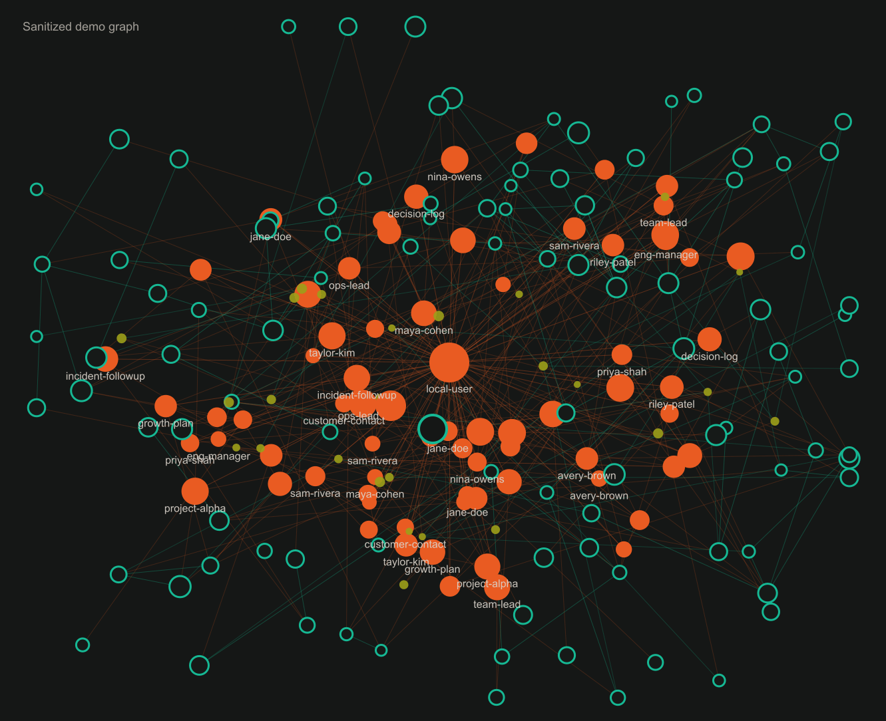

<p align="center">
  
  <br>
  <em>Sanitized demo graph view.</em>
</p>

# Personal Memory

Personal Memory is a local-first RAG memory store for people, projects,
decisions, meetings, incidents, hiring context, and long-running work history.
It gives agents such as Codex and Claude Code a grounded way to remember and
recall context without sending your private memory corpus to a hosted service.

Markdown is the source of truth. The search index is rebuildable. Embeddings run
locally by default.

## Quick Start

Requires Node.js 20 or newer.

```bash
git clone https://github.com/vladimanaev/personal-memory.git
cd personal-memory
npm install
npm run index
npm start
```

`npm start` opens the local UI at `http://127.0.0.1:4664`.

## Use It

Open Claude Code or Codex with this repository as the working directory, then
ask naturally. The agent reads the repo instructions, uses the memory skills,
and calls the local CLI behind the scenes.

```bash
cd personal-memory
claude
```

Or open this folder as the workspace in Codex.

### Use it from any project (plugin marketplace)

The memory skills also ship as a plugin, so capture-worthy moments in
*other* repos ("remember that we decided X" mid-review) don't require
switching sessions. The repo itself is the marketplace — one manifest serves
both CLIs:

```bash
# Claude Code (inside a session)
/plugin marketplace add vladimanaev/personal-memory
/plugin install personal-memory@personal-memory

# Codex
codex plugin marketplace add https://github.com/vladimanaev/personal-memory
codex plugin add personal-memory@personal-memory
```

> Install from Git (as above), not from a local path: a local-path
> marketplace add copies the working tree verbatim into the plugin cache —
> including the private, gitignored `memory/` store. A Git add clones tracked
> content only.

Then tell the installed skills where your clone lives (the CLI resolves the
store from its working directory):

```bash
# in your shell profile
export MEMORY_HOME="$HOME/path/to/personal-memory"
```

Inside the personal-memory repo the skills keep working as before —
`MEMORY_HOME` is only consulted when you're elsewhere.

Capture:

```text
"Log this 1:1 with Jane: promotion readiness, scope gaps, and a follow-up for next Friday."
"Remember that the platform team decided to defer project alpha until Q4."
"Capture this incident summary and tag it with reliability."
```

Recall:

```text
"What do I know about Jane's promotion readiness?"
"Find the decision we made about project alpha."
"Help me prep for my next 1:1 with Jane using memory."
```

Plan with memory:

```text
"Use memory to summarize open hiring threads from this quarter."
"What context should I remember before the roadmap review?"
"Pull the relevant history before we decide whether to revisit project alpha."
```

Pull from connected sources:

```text
"Pull recent memories from Gmail, Slack, and Google Chat."
"Use the connector settings to ingest memory-worthy updates from the last week."
"Every 4 hours, pull Gmail and Slack and log anything memory-worthy."
```

Connector pulls use the skill system and connector prompts to fetch, filter,
deduplicate, and update memories over time.

Track a matter over time:

```text
"Log that the queue technology decision is still pending — Kafka vs RabbitMQ."
"Remember we decided on Kafka; this settles the pending queue decision."
"Is the queue technology decision still open?"
```

When a memory develops or settles an earlier one, the agent links them with a
`follows` chain. Recall then annotates any stale chain member with the entry
that superseded it, and open pending decisions and todos report whether they
were resolved — so an old snapshot can never masquerade as the current state.

Agents should retrieve through the local memory CLI, write through `memory add`,
and cite the memory files they used. The full agent contract is in
[AGENTS.md](AGENTS.md).

## Why This Exists

Long-running work creates context that does not fit in chat history: people,
decisions, feedback, planning threads, hiring notes, operational incidents, and
follow-ups. Personal Memory keeps that context in a local, queryable record that
an agent can retrieve before answering.

Key properties:

- **Local-first**: entries, index, and default embeddings stay on disk.
- **Plain Markdown**: every memory is readable and portable.
- **Hybrid retrieval**: semantic search, BM25 lexical search, and rank fusion.
- **Structured filters**: query by person, team, tag, date, and memory type.
- **Deduped capture**: source IDs and near-duplicate checks avoid noisy repeats.
- **Timeline chains**: evolving matters (note → pending decision → decision) are
  linked, so recall surfaces the latest state instead of a stale snapshot.
- **Agent-native**: skills and guardrails tell agents when to capture or recall.
- **Local UI**: browse, search, inspect the graph, and edit connector config.

## CLI Reference

Most users should interact with Personal Memory through an agent. The CLI is the
local engine that agents call, and it is useful when debugging, scripting, or
checking connector/index health.

```text
memory add --title "..." --type <type> [--people a,b] [--teams x,y]
           [--tags a,b] [--date YYYY-MM-DD] [--body "..."]
           [--source-ids slack:C123:1700000000.1,gmail:<thread-id>]
           [--connector raw-capture]
           [--follows <earlier-id,...>]
           [--update <id>] [--force-new]

memory link <id> --follows <earlier-id,...>

memory query "<question>" ["<alternate phrasing>" ...]
             [--person slug] [--type type] [--team slug] [--tag slug]
             [--since YYYY-MM-DD] [--until YYYY-MM-DD] [-k n] [--deep]

memory recall "<question>" ["<agent phrasing>" ...]
              [--person slug] [--type type] [--team slug] [--tag slug]
              [--since YYYY-MM-DD] [--until YYYY-MM-DD] [-k n]
              [--complete | --complete-if-small | --no-complete]
              [--require-complete] [--no-expand] [--format text|json]

memory list [--person slug] [--type type] [--team slug] [--tag slug]
            [--since YYYY-MM-DD] [--until YYYY-MM-DD] [--limit n]

memory person <slug> [--graph <name>]
memory digest --person <slug> | --quarter <YYYY-Qn> | --tag <slug> [--graph <name>]
memory remove <id>
memory copy <id> --to <graph>
memory move <id> --to <graph>
memory graphs [list] | graphs create <slug> | graphs sync [--dry-run]
memory rules [list] | rules apply [--dry-run]
memory promote candidates --to <graph> | promote dismiss <id> --graph <g>
memory maintenance [--threshold n]
memory connectors
memory connectors mark-pulled <name> [--at ISO_TIMESTAMP]
memory connectors mark-captured <name> [--at ISO_TIMESTAMP]
memory ui [--port n] [--no-open]
```

For debugging, run those commands as `npm run memory -- <command>`.

Supported memory types:

```text
event, decision, todo, pending-decision, 1on1, hiring, incident,
achievement, feedback, meeting, note, summary
```

## How It Works

Personal Memory separates durable content from derived search state, and
organizes the durable content into graphs:

- `memory/entries/YYYY/MM/<id>.md` is the **default graph** — secret,
  local-only, and the home of every capture. If you never create another
  graph, everything simply lives here.
- `memory-graphs/<slug>/entries/YYYY/MM/<id>.md` stores each named SHARED
  graph — physically separate stores (each its own nested git repo)
  deliberately safe to hand to a specific audience. None ship built-in: you
  create them with `memory graphs create <slug>` or the UI's Graphs screen,
  and each carries a `GRAPH.md` manifest (description + eligibility notes,
  seeded from a template). One memory can be a member of several graphs —
  the CLI materializes byte-identical synced copies, with the default graph
  always the home. Capture always lands in the default graph; entries enter
  shared graphs through per-tag/per-type distribution rules (configured in
  the UI, dry-run preview, auto-applied to future captures), a
  user-confirmed promotion review (`/promote --to <graph>`), or an explicit
  request. Recall spans all graphs by default (`--graph <name>` narrows);
  every shared store is self-contained — its entries never reference
  non-members.
- `memory/summaries/<id>.md` stores additive summaries created by `digest`.
- `.index/` stores rebuildable local search artifacts (both graphs, with a
  `graph` column).
- `connectors/<name>.md` stores public connector templates.
- `memory/connectors/<name>.md` stores private connector overrides.

Each entry has strict YAML frontmatter:

```yaml
id: 2026-06-28-acme-kickoff
date: 2026-06-28
type: meeting
title: Kickoff with Acme
people: [jane-doe, john-smith]
teams: [platform-team]
tags: [roadmap, partnership]
source_ids: [slack:C0123ABCD:1700000000.0012]
follows: [2026-06-20-acme-partnership-pending]
```

### Timeline chains

The optional `follows` field links an entry to the earlier entries it develops
or settles, forming a chain per evolving matter. Everything else is derived at
read time — nothing to keep in sync:

- Recall and query hits carry the chain context: stale members are annotated
  with `⤷ superseded by: <id>`, and pending decisions and todos report
  `status: open` or `status: resolved by <id>` (also in `--format json`).
- Ranking gets a mild recency boost (at most +2%, decaying over ~3 months), so
  newer entries win near-ties without burying strong older matches.
- `memory maintenance` — and the web UI's maintenance screen — suggest likely
  missing links for still-open items (semantically close later entries sharing
  a person or tag), with one-click link and dismiss in the UI.
- The UI shows each chained entry's full timeline in its detail panel, and the
  graph view draws chains as dashed edges between entries.

Links are validated at write time (targets must exist, must not be newer, and
cycles are rejected). Settle an open matter by logging a new linked entry, not
by rewriting the old one — the history stays intact.

The index combines:

- local embeddings via Transformers.js
- LanceDB for vector search
- persistent BM25 lexical search
- reciprocal rank fusion
- metadata prefilters and source-of-truth validation

Rebuild the index at any time:

```bash
rm -rf .index
npm run index -- --force
```

## Upgrading an existing memory store to the new code

Pulling the multi-graph code onto a machine with an existing store is safe by
construction: every store is gitignored and versioned in its own nested repo,
so `git pull` cannot touch a single entry file, and **every existing memory
stays exactly where it is** — membership is derived from file locations, so
nothing inside `memory/` needs migrating or reclassifying. Take a backup
first anyway (good practice before any migration):

```bash
tar -czf ~/memory-backup-$(date +%Y%m%d).tgz memory memory-public memory-graphs 2>/dev/null \
  || tar -czf ~/memory-backup-$(date +%Y%m%d).tgz memory
```

Then run the (idempotent) migration — the engine refuses to run on an old
layout until it has:

```bash
git pull
npx tsx scripts/migrate-graphs.ts
```

Or use the all-in-one wrapper, which creates and verifies a private backup,
fast-forwards from the configured upstream when possible, installs dependencies,
runs the migration, and prints the resulting graph registry:

```bash
./scripts/migrate.sh
```

It never pushes commits or memory data to a remote. Run
`./scripts/migrate.sh --help` for options such as `--no-update`,
`--skip-install`, and a custom backup directory.

Keep this wrapper as the stable entry point for future project migrations:
new migration steps can be added behind the same backup-first command instead
of requiring users to assemble a new upgrade sequence for every release.

The backup includes the complete graph-store layout: `memory/`, the legacy
`memory-public/` store when present, and every named graph under
`memory-graphs/`. It also preserves connector timestamps, promotion/chain/slug
dismissals, and deferred slug proposals from `.index/`; search tables and
caches remain rebuildable. Validate or restore one of those archives with:

```bash
./scripts/restore_backup.sh ../personal-memory-backups/personal-memory-<timestamp>.tgz --dry-run
./scripts/restore_backup.sh ../personal-memory-backups/personal-memory-<timestamp>.tgz --confirm
```

Restore validates paths and archive integrity before replacing anything, makes
another verified backup of the current stores and workflow state, and restores
the archive as one complete layout. For the current layout it rebuilds the
derived index when Node.js 20+ and local dependencies are available; otherwise
it prints the commands to run later. If a later step fails, it rolls the
original stores and complete prior index back automatically. An archive
containing the legacy `memory-public/` layout is restored exactly without an
index rebuild—the CLI remains unavailable until that layout is migrated again
with `./scripts/migrate.sh`.

What it does depends on where you're coming from:

- **From the original single-graph layout** (just `memory/`): nothing
  relocates — all your memories are in the `default` graph by construction.
  The script checkpoints `memory/.git` and rebuilds the search index (the
  new format has a membership column; a few minutes, once).
- **From the two-graph layout** (`memory-public/` exists): if it holds
  entries, the script relocates it to `memory-graphs/public/` — a plain
  directory rename, its git history moves with it — and writes it a
  `GRAPH.md` manifest; afterwards `public` is an ordinary named graph like
  any you create yourself (deletable anytime via the Graphs screen or
  `memory graphs delete public --confirm`). An EMPTY public store is simply
  dropped — no graph ships by default.
- Re-running the script is always a no-op; it finishes with a consistency
  check (`memory graphs sync --dry-run`).

Vocabulary changes to be aware of: the home graph is now named `default`
(`--graph private` is now `--graph default`); `promote` and `recall-graph`
take an explicit graph name; the routing prompt is gone — per-graph
eligibility criteria live in each graph's `GRAPH.md`. Marketplace/plugin
users: update the clone `MEMORY_HOME` points at before using the new
`graphs`/`copy`/`rules` commands.

## Privacy

The default setup is intentionally local:

- `memory/` and `memory-graphs/` are ignored by the main git repository
  (every store is versioned in its own local nested git repo).
- Graph separation is physical: each shareable unit is one
  `memory-graphs/<slug>/` directory alone, and nothing in it may reference
  anything outside that graph — not even an entry id.
- `.index/` is ignored and can be regenerated.
- The UI binds to `127.0.0.1`.
- Embeddings run locally with `Xenova/bge-small-en-v1.5`.
- No API backend is used unless you explicitly set `MEMORY_EMBEDDINGS`.

Optional remote embedding backends can be enabled deliberately:

```bash
MEMORY_EMBEDDINGS=openai npm run index -- --force
MEMORY_EMBEDDINGS=voyage npm run index -- --force
```

Do not publish a populated `memory/` directory or screenshots containing private
names, events, or relationships unless you have intentionally sanitized them.

## Agent Workflows

This repository is designed for coding agents that operate over the local
folder. The important conventions live in:

- [AGENTS.md](AGENTS.md) - shared rules for capture, recall, citations, and
  local-only use
- [MEMORY-GUARDRAILS.md](MEMORY-GUARDRAILS.md) - write safety contract for
  `memory/`
- [skills/log-memory/SKILL.md](skills/log-memory/SKILL.md) - creating or
  updating memories
- [skills/recall-memory/SKILL.md](skills/recall-memory/SKILL.md) - retrieving
  grounded context (both graphs)
- [skills/recall-graph/SKILL.md](skills/recall-graph/SKILL.md) - single-graph
  recall for shareable output
- [skills/promote-graph/SKILL.md](skills/promote-graph/SKILL.md) - user-confirmed
  promotion of memories into named shared graphs
- [skills/manage-graphs/SKILL.md](skills/manage-graphs/SKILL.md) - graph
  creation, distribution rules, and consistency repair
- [skills/compact-tags/SKILL.md](skills/compact-tags/SKILL.md) - merging
  similar/duplicate tags with per-merge confirmation
- [.claude/commands/remember.md](.claude/commands/remember.md),
  [.claude/commands/recall.md](.claude/commands/recall.md), and
  [.claude/commands/compact-tags.md](.claude/commands/compact-tags.md) - Claude
  Code slash commands

Agents should retrieve through the CLI instead of searching `memory/` directly,
and should write entries through `memory add` instead of hand-editing files.

## Development

```bash
npm install
npm run memory -- help
npm run typecheck
npm run index
```

Project layout:

```text
src/                      TypeScript CLI, indexing, schema, server, and UI APIs
src/ui/                   Local browser UI
skills/                   Agent skills for capture, recall, and pull workflows
connectors/               Public connector templates
memory/                   The DEFAULT memory graph + connector/rules config (gitignored, own nested repo)
memory-graphs/            Named SHARED graphs, one dir per graph (gitignored, each its own nested repo)
.index/                   Rebuildable local index (gitignored)
.claude/                  Claude Code commands, hooks, and settings
docs/assets/              Public README assets
```

## Community

- Contributing: [CONTRIBUTING.md](CONTRIBUTING.md)
- Security reports: [SECURITY.md](SECURITY.md)
- Code of conduct: [CODE_OF_CONDUCT.md](CODE_OF_CONDUCT.md)
- License: [Apache License 2.0](LICENSE)
